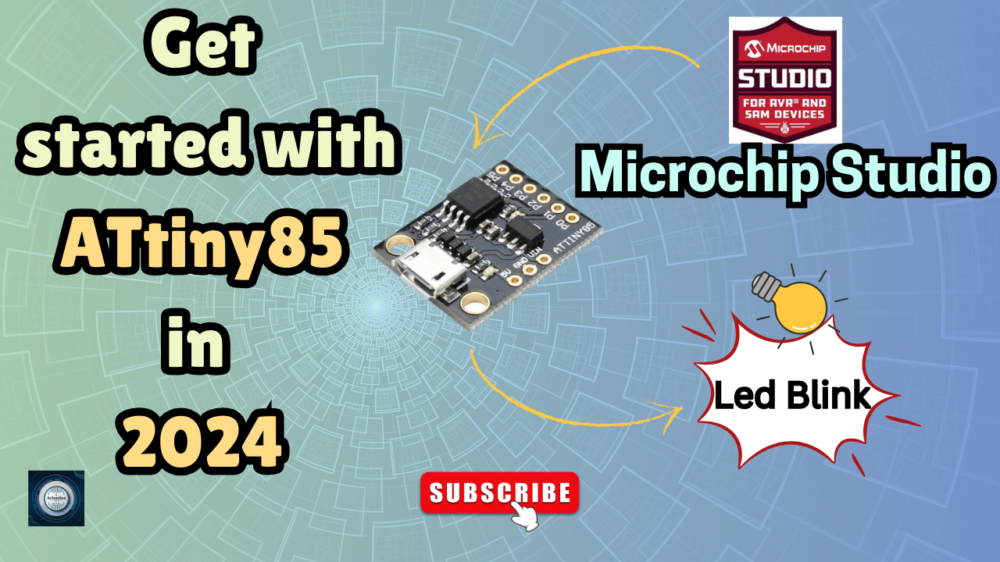

<h1 align="center">
  <a href="https://www.youtube.com/@eccentric_engineer">
	
  </a>  
</h1>

<h3 align="center">
	DIY Custom Infrared Remote using ATtiny85 microcontroller 
</h3>


  
## 📝 Overview

Recently, I was facing issues with remote of multiple appliances which made me look into a custom diy solution. So, I took over my ATtiny85 usb based board 
to get started with accessing my devices using IR sensor and protocol.This project only covers IR transmitting part and relies on Arduino or Logic Analyzer
for 38Khz IR receiver data. Since, we won't be having access to the appliance remote, we make use of IR blaster in modern phones and attempt to identify 
correct remote control interface to control our device then connect our sensor with Arduino or ESP32 board to read data using Arduino Interface or Saleae logic 
analyzer using Logic Software.
Learn more 👇👇  
  
[](https://youtu.be/9isO4R13i0A?si=mk0SPho4BUEahCk1)

## ✔️ Requirements

### 📦 Hardware
- ATtiny85 USB board (main controller)
- USBAsp Programmer  (to upload code to chip)
- 38Khz IR transmitter & receiver  (to transmit IR data to appliances/to receive IR data from phone and decode)
- Tactile button with cap  (to execute function - power,volume/temperature plus or minus) 
- SPDT slide switch (to select device TV/AC)
- AAA battery case for 3 cells  (for batteries)
- 3 x AAA batteries   (to power system)
- Perf board  
- Female Header Pins
- A Mobile Phone with IR Blaster   (to send IR data to receiver and decode what data needs to be transmitted)
- Arduino or ESP32   (to read IR data on Arduino IDE)
- Logic Analyzer  (optional) (to analyze received IR data) 

### 📂 Software
- Arduino IDE (for reading IR data using Arduino or ESP32 👉 https://www.arduino.cc/en/software)  
  Library used: https://github.com/Arduino-IRremote/Arduino-IRremote.
- Logic 2.4.13 (for reading IR data using logic analyzer 👉 https://support.saleae.com/logic-software/sw-download)
- Microchip Studio (for developing code of ATtiny85 👉 https://www.microchip.com/en-us/tools-resources/develop/microchip-studio)

## 🛠️ Installation and usage

```sh
git clone https://github.com/AvinasheeTech/IR_Remote_ATtiny85.git
cd IR_Remote_ATtiny85/
Open IR_Remote.atsln file in Microchip Studio 
Select main.c file and click on Build->Build IR_Remote
Next Upload code by clicking on Tools->USBasp_attiny85
Enjoy...🍹
```
To learn more about how to upload code and create external tool for ATtiny85 on Atmel Studio, click link below 👇👇  

[](https://youtu.be/PY9RVh3wAJM?si=SjmBTnHeOB7SD06J)


## ⭐️ Show Your Support

If you find this helpful or interesting, please consider giving us a star on GitHub. Your support helps promote the project and lets others know that it's worth checking out. 

Thank you for your support! 🌟

[](https://github.com/AvinasheeTech/IR_Remote_ATtiny85/stargazers)
